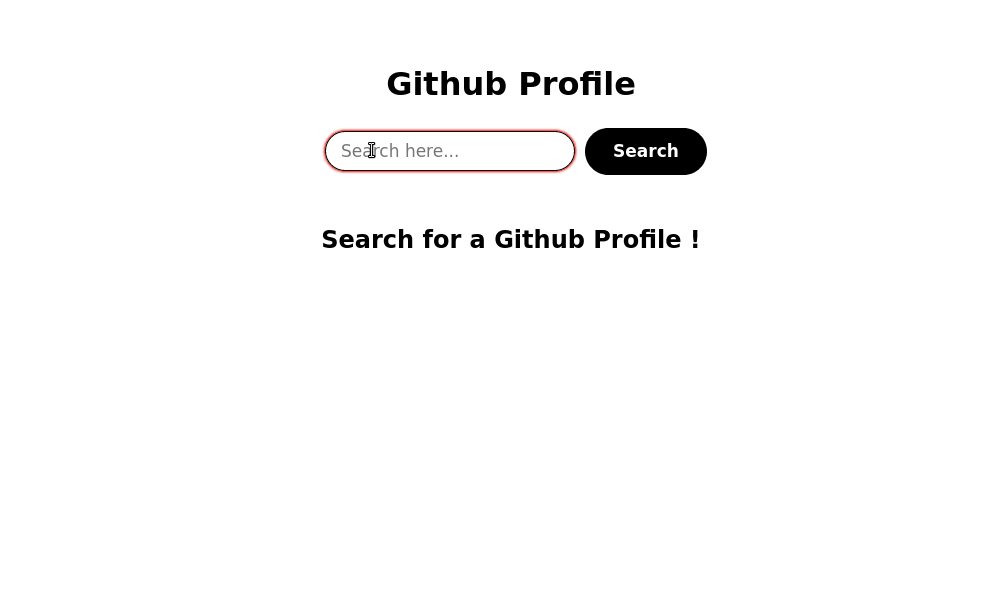

# htmx-github-search
Github search using [htmx](https://htmx.org) and Node.js

You can see the app in live [here](https://htmx-github-search.herokuapp.com)

## Usage
Clone this repo, install dependencies and npm start
```
git clone https://github.com/rajasegar/htmx-github-search
cd htmx-github-search
npm install
npm start
```

You can view the app in the browser at `localhost:3000`.


